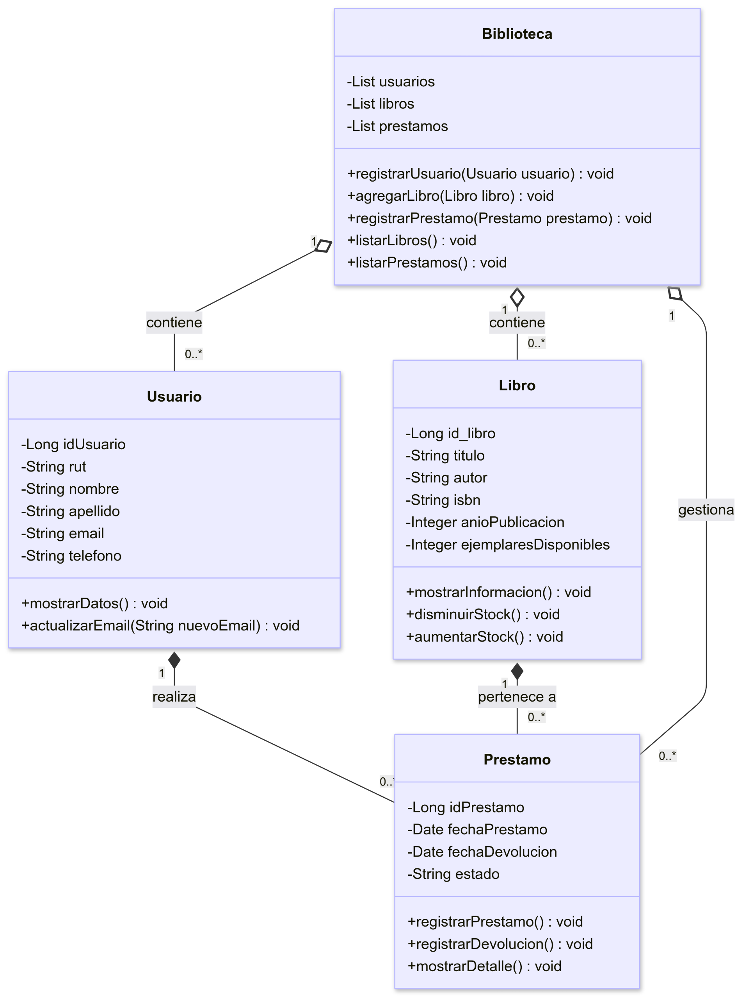

# Sistema biblioteca
Consiste en un sistema para gestionar un biblioteca mediante metodos como: agregar, eliminar, editar y buscar libros.

**Autor:** 
Miguel Cordero
**Curso:**
4°Medio A

## Tecnologías utilizadas:

Spring Boot y Java 17 para el backend.

H2 Console para simular la base de datos.

Conexión a la API externa de Google Books para buscar libros por ISBN.

HTML, CSS y Bootstrap para el diseño del frontend.

# Estructura del proyecto
src/ 
└── main/ 
├── java/ 
│ ├── controller/ → Controladores de las rutas 
│ ├── model/ → Entidades 
│ ├── repository/ → Interfaces para acceso a la base de datos 
│ ├── services/ → Lógica detras de la funcionalidad de la página (Agregar, eliminar, editar y buscar) 
│ └── BibliotecaApplication.java → Clase principal 
└── resources/ 
├── static/ → Archivos estáticos (CSS) 
├── templates/ → Páginas HTML 
└── application.properties → Configuración del proyecto 

# Instrucciones para ejectuar el programa
- Requisitos: 
→ Tener instalado Java 17 o superior 
→ Tener un IDE compatible(Visual Studio Code, IntelliJ) 
→ Git bash para clonar el repositorio 

- Ejecución:  
→ git clone https://github.com/mcordero123/Biblioteca.git  
→ Entrar a la carpeta del proyecto y ejecutar la clase principal BibliotecaApplication.java desde tu IDE.  
→ Una vez iniciada la clase principal, debes ingresar a tu navegador y acceder a http://localhost:8080/libros/nuevo 

- Si deseas acceder a la consola, sigue estos pasos:  
→ Abrir en tu navegador http://localhost:8080/h2-console  
→ Completar con los siguientes datos:  
**Campo**	       **Valor** 
JDBC URL:	jdbc:h2:mem:bibliotecadb 
User Name:	sa 
Password:    **vacio** 
→ Hacer click en Connect para acceder a la BD

