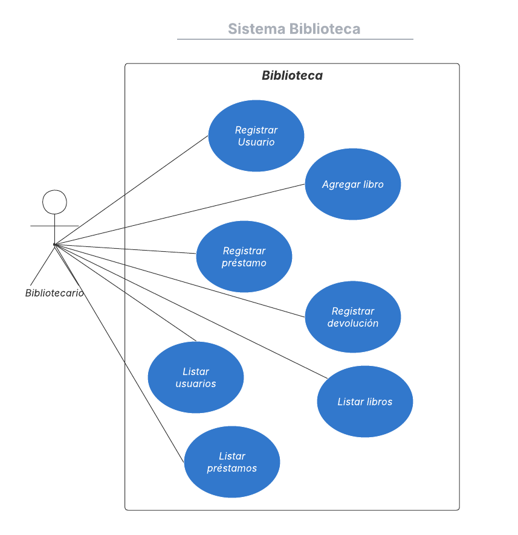

# Sistema biblioteca
Consiste en un sistema para agregar, eliminar, editar y buscar libros mediante el ISBN
**Integrante:** 
Miguel Cordero
**Curso:**
4°Medio A

Para iniciar el programa se debe de ejecutar BibliotecaApplication.java

Tecnologías utilizadas:

Spring Boot y Java para el backend.

H2 Console para simular la base de datos.

Conexión a la API externa de Google Books para buscar libros por ISBN.

HTML, CSS y Bootstrap para el diseño del frontend.
